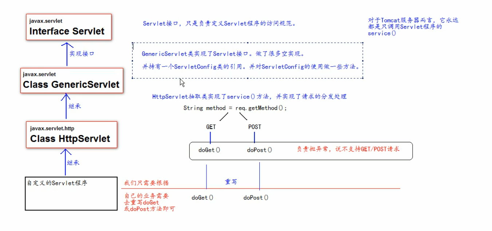
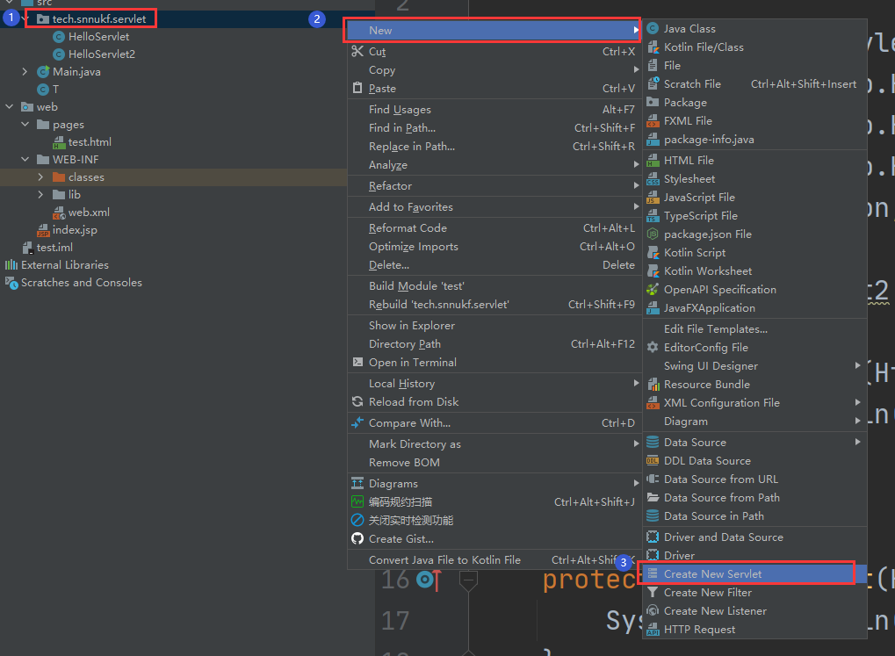
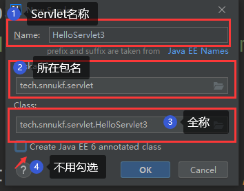
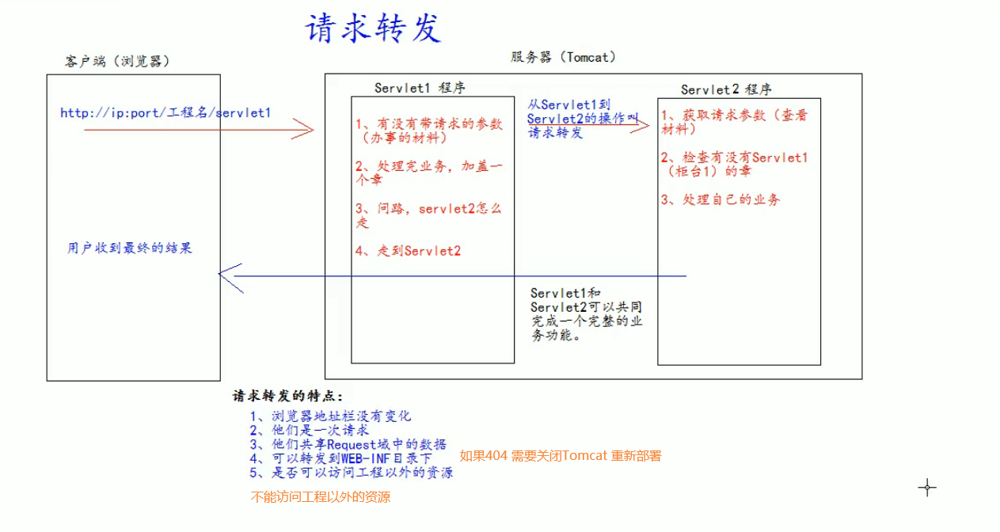
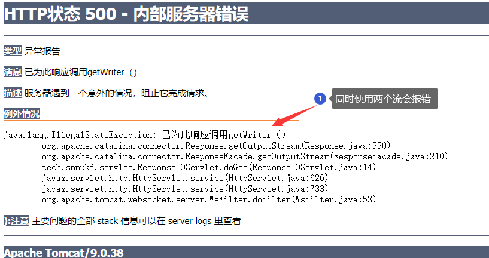
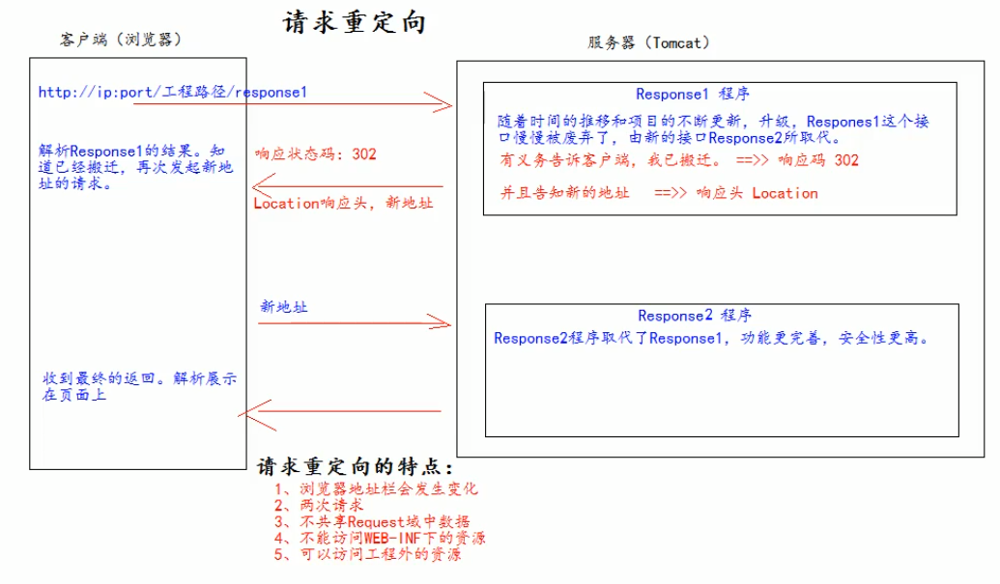

# Servlet

<div align="center">
  
</div>

## 1. Servlet技术

### web.xml

配置Servlet名称-路径映射 等

```xml
<web-app>
    <!-->servlet name以及工程对应的类 <-->
    <servlet>
        <servlet-name>HelloServlet</servlet-name>
        <servlet-class>tech.snnukf.servlet.HelloServlet</servlet-class>
    </servlet>
    
    <!-->servlet name以及工程下的url <-->
    <servlet-mapping>
        <servlet-name>HelloServlet</servlet-name>
        <url-pattern>/hello</url-pattern>
    </servlet-mapping>
</web-app>
```


### HTTPServlet

- 工程中写Servlet可以继承HTTPServlet然后覆写doGet()、doPost()方法来分别处理get和post请求

```java
    @Override
    protected void doGet(HttpServletRequest req, HttpServletResponse resp) throws ServletException, IOException {
       //处理get请求的代码
    }

    @Override
    protected void doPost(HttpServletRequest req, HttpServletResponse resp) throws ServletException, IOException {
       //处理post请求的代码
    }
}
```

- 也可以使用IDEA直接创建Servlet

<div align="center">
  
</div>

配置Servlet信息(不包含servlet-mapping)

<div align="center">
  
</div>

## 2. ServletConfig类

Servlet程序的配置信息类

Servlet程序和ServletConfig对象都是由Tomcat负责创建，用户负责使用。

Servlet程序默认是第一次访问是创建，ServletConfig是每个Servlet程序创建时，就创建一个对应的ServletConfig对象。

### ServletConfig类的三大作用

- 获取servlet程序的别名servlet-name的值
- 获取初始化参数init-param
- 获取ServletContext对象

###### 注意：

```java
@Override
public void init(ServletConfig config) throws ServletException {
    //需要调用父类的init方法
    super.init(config);
    System.out.println("Do something");
}
```

## 3. ServletContext类

### 3.1 什么是ServletContext类

1. ServletContext是一个接口，它表示Servlet上下文对象
2. 一个web工程，只有一个ServletContext对象实例
3. 是一个域对象（可以像Map一样存取数据的对象叫做域对象，这里的域指的是存取数据的操作范围）
4. 在web工程部署启动的时候创建。在web工程停止的时候销毁。

|        | 存数据         | 取数据         | 删除数据          |
| ------ | -------------- | -------------- | ----------------- |
| Map    | put()          | get()          | remove()          |
| 域对象 | setAttribute() | getAttribute() | removeAttribute() |

### 3.1 ServletContext类常见作用

1. 获取web.xml中配置的上下文参数context-param
2. 获取当前工程路径
3. 获取工程部署后在服务器硬盘上的绝对路径
4. 像Map一样存取数据，作用范围为整个工程

```java
    protected void doGet(HttpServletRequest request, HttpServletResponse response) throws ServletException, IOException {
        //1. 获取web.xml中配置的上下文参数context-param
        ServletConfig servletConfig = getServletConfig();
        ServletContext servletContext = servletConfig.getServletContext();
        System.out.println("context-param username = " + servletContext.getInitParameter("username"));

        //2. 获取当前工程路径
        System.out.println("contextPath = " + servletContext.getContextPath());

        //3. 获取工程部署后在服务器硬盘上的绝对路径
        // 斜杠被解析为 http://ip:port/工程名/
        System.out.println("realPath = " + servletContext.getRealPath("/"));

        //4. 像Map一样存取数据
        servletContext.setAttribute("password", "123456");
        System.out.println("password = " + servletContext.getAttribute("password"));
        servletContext.removeAttribute("password");
        System.out.println("password = " + servletContext.getAttribute("password"));
    }
```

## 4. HttpServletRequset类

### 4.1 作用

每次只要有请求进入Tomcat服务器，Tomcat服务器会把解析好的HTTP协议信息封装到Requset对象中。然后传递到service方法中去。可以通过HTTPServletRequset对象，获取到所有请求的信息。

### 4.2 常用方法

| 方法                     | 作用                               |
| ------------------------ | ---------------------------------- |
| getRequestURI()          | 获取请求的资源路径                 |
| getRequestURL()          | 获取请求的统一资源定位符（URL）    |
| getRemoteHost()          | 获取客户端IP                       |
| getHeader()              | 获取请求头                         |
| getParameter()           | 获取请求的参数                     |
| getParameterValues()     | 获取请求的参数（多个值的时候使用） |
| getMethod()              | 获取请求的方式（GET或POST）        |
| setAttribute(key, value) | 设置域数据                         |
| getAttribute(key)        | 获取域数据                         |
| getRequestDispatcher()   | 获取请求转发对象                   |

```java
    protected void doGet(HttpServletRequest request, HttpServletResponse response) throws ServletException, IOException {
        //获取请求的资源路径
        System.out.println("URI ==> " + request.getRequestURI());

        //获取请求的统一资源定位符（URL）
        System.out.println("URL ==> " + request.getRequestURL());

        //获取客户端IP
        System.out.println("Client IP : " + request.getRemoteHost());

        //获取请求头
        System.out.println("User request header ==> " + request.getHeader("User-Agent"));

        //获取请求的方式（GET或POST）
        System.out.println("request method ==> " + request.getMethod());
    }
```

```java
    protected void doPost(HttpServletRequest request, HttpServletResponse response) throws ServletException, IOException {

        //设置请求的字符集为UTF-8，从而解决post请求的中文乱码问题 需要放在前面 否则会出错
        request.setCharacterEncoding("UTF-8");

        //获取单个参数
        String pass = request.getParameter("password");
        String username = request.getParameter("username");
        //获取有多个值的参数
        String[] hobby = request.getParameterValues("hobby");

        System.out.println("username ==> " + username);
        System.out.println("password ==> " + pass);
        System.out.println("hobby ==> " + Arrays.asList(hobby));
    }
```

### 4.3 请求转发

指的是服务器收到请求后，从一个资源跳转到另一个资源的操作。


<div align="center">
  
</div>
### 4.4 base标签的作用

base标签可以设置当前页面中所有相对路径，工程运行时参照哪个路径进行跳转

```html
<!DOCTYPE html>
<html lang="en">
<head>
    <meta charset="UTF-8">
    <title>Title</title>
</head>
<body>
    <base href="http://localhost:8080/07_Servlet_Web_exploded/pages/a/b/c.html">
    这是a下的b下的c.html<br/>
    <a href="http://localhost:8080/07_Servlet_Web_exploded/index.html">跳转到首页</a><br/>

    <a href="../../../index.html">跳转到首页</a>


</body>
</html>
```

### 4.5 web中的相对路径和绝对路径

. 当前目录

.. 上一级目录

资源名 当前目录下的资源


http://localhost:8080/Projectname/Sourcename 绝对路径

### 4.6 web中 / 斜杠的不同含义

在web中 / 斜杠 是一种绝对路径

/ 斜杠如果被浏览器解析 得到的是  http://ip:port/

/ 斜杠如果被服务器解析，得到的是 http://ip:port/ProjectName

- <url-pattern>/servlet</url-pattern>
- servletContext.getRealPath("/")
- request.getRequestDispatcher("/")

特殊情况：response.sendRediect("/") 把 / 发送给浏览器解析 得到 http://ip:port/

## 5. HttpServletResponse类

​		与HttpServletRequest对象一样，每次请求进来，Tomcat服务器会创建一个Response对象传递给Servlet程序去使用。HttpServletRequest表示请求过来的信息，HttpServletResponse表示所有响应的信息。

​		如果需要设置返回给客户端的信息，都可以通过HttpServletResponse对象进行设置。

### 5.1 两个输出流

|        |                   |                              |
| ------ | ----------------- | ---------------------------- |
| 字符流 | getOutputStream() | 常用于下载（传递二进制数据） |
| 字节流 | getWriter()       | 常用于回传字符串（常用）     |

两个流只能使用一个，不能同时使用

<div align="center">
  
</div>

### 5.2 往客户端回传数据&&解决响应乱码

```java
    //输出字符串
	protected void doGet(HttpServletRequest req, HttpServletResponse resp) throws ServletException, IOException {
        
        //设置服务器编码以及浏览器响应头编码为UTF-8
        resp.setCharacterEncoding("UTF-8");
        resp.setHeader("Content-Type", "text/html; charset=UTF-8");
        
        //与 resp.setCharacterEncoding("UTF-8"); 和 resp.setHeader("Content-Type", "text/html; charset=UTF-8");等效
        //但是该方法需在获取流之前使用
        //推荐使用该方法
        resp.setContentType("text/html; charset=UTF-8");

        PrintWriter writer = resp.getWriter();
        writer.println("hello 要开心呀~");
    }
```

### 5.3 请求重定向

指的是客户端给服务器发送请求，然后服务器返回给客户端一个新地址，让浏览器去访问（因为之前的地址可能已经被废弃）。

<div align="center">
  
</div>

第一种方案

```java
//设置响应状态码，表示重定向
resp.setStatus(302);
//设置响应头，说明新的地址在哪里
resp.setHeader("Location", "http://localhost:8080/07_Servlet_Web_exploded/response2");
```

第二种方案(推荐)

```java
resp.sendRedirect("http://localhost:8080/07_Servlet_Web_exploded/response2");
```

