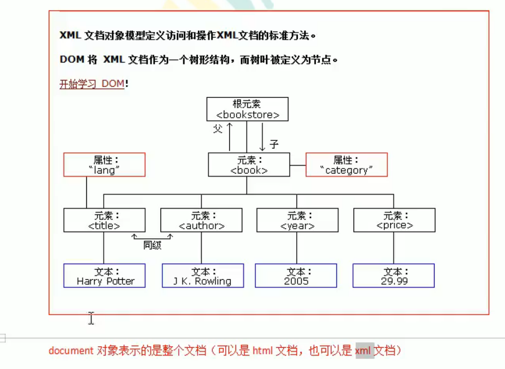

# XML

## 1. 什么是XML&作用

**可扩展**（标签可以自定义）的标记性语言

### 1.1 作用

1. 用来保存数据，而且这些数据具有自我描述性
2. 作为项目或模块的配置文件
3. 作为网络传输数据的格式（不常见，现在主要为JSON）

```xml
<students>
    <student>
    	<id>1</id>
        <name>KingStrong</name>
    </student>
    <student>
    	<id>2</id>
        <name>MonkeyBrother</name>
    </student>
</students>
```

## 2. xml 语法

- 文档声明
- 元素（标签）
- xml属性
- xml注释
- 文本区域（CDATA区）

### 2.1 文档声明&&注释

```xml
<?xml version="1.0" encoding="utf-8" ?>
<!--
    xml文件的声明
    <?xml version="1.0" encoding="utf-8" ?>
    version="1.0"   表示xml的版本
    encoding="utf-8"    表示xml文件的编码
-->

<books> <!-- 表示多个图书的信息 -->
    <book sn="SN123456789"> <!-- 表示一个图书的信息 -->
        <name>Java从入门到放弃</name> <!-- 书名 -->
        <author>S.B.</author> <!-- 作者 -->
        <price>9.9</price> <!-- 价格 -->
    </book>
</books>
```

### 2.2 xml元素（标签）

指的是从（包括）开始标签直到（包括）结束标签的部分。

元素可以包含其他元素、文本或者两者的混合。元素也可以拥有属性。

```xml
<name>Java从入门到放弃</name> <!-- 书名 -->
```

#### 2.2.1 命名规则

1. 名称可以包含字母、数字及其他字符
2. 名称不能以数字或者标点开头
3. 名称不能包含空格
4. 也分单标签和双标签

```xml
<book sn="SN123456789" /> <!-- 单标签 -->

<book sn="SN123456789"> </book> <!-- 双标签 -->
```

 

### 2.3 xml属性

与html标签类似，属性可以提供元素的额外信息

在标签上可以书写属性：

​	一个标签可以书写多个属性。**每个属性的值必须使用 引号 引起来**。

### 2.4 语法规则

#### 2.4.1 所有xml元素都须有关闭标签（也就是闭合）

#### 2.4.2 xml标签对大小写敏感

#### 2.4.3 xml必须有根元素（顶级元素）

没有父标签的元素，叫做顶级元素

根元素是没有父标签的顶级元素，而且是唯一一个。

#### 2.4.4 xml的属性值必须加引号

#### 2.4.5 xml中的特殊字符

```xml
&lt; 小于号
&gt; 大于号
```

#### 2.4.6 必须正确嵌套

#### 2.4.7 文本区域（CDATA区）

CDATA格式：

```xml
<![CDATA[这里可以把你输入的字符原样显示，不会解析xml]]>
```

## 3. xml解析技术

xml是可扩展的标记性语言。不管是html文件还是xml文件它们都是标记型文档，都可以使用w3c组织制定的dom技术来解析。

<div align='center'>
    
</div>


