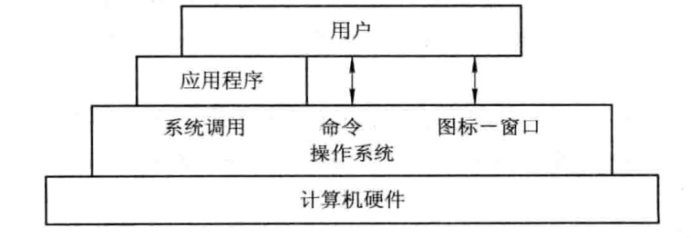
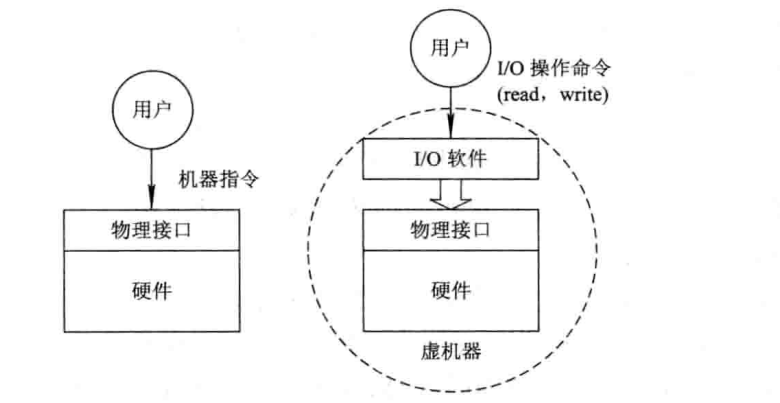

# 操作系统相关

## 1. 操作系统引论

### 1.1 操作系统的目标和作用

##### 什么是操作系统，操作系统的主要作用是什么？

​		操作系统（Operating System，OS）是配置在计算机硬件上的第一层软件，是对硬件系统的首次扩充。主要功能是管理好计算机上的硬件设备，提高硬件设备的利用率和系统的吞吐量，并为用户和应用程序提供一个简单的接口，便于用户使用。

​		操作系统的目标：方便性、有效性、可扩充性和开放性。

​		主要功能（作用）：

- 作为用户与计算机硬件系统之间的接口
- 作为计算机系统资源的管理者
- 实现了对计算机资源的抽象

    
    OS作为接口的示意图

    
     
    I/O软件隐藏了I/O操作实现的细节

### 1.2 操作系统的基本特性（并发、共享、虚拟和异步）

### 

## 2. 知识点

### 2.1 设备管理

#### 2.1.1 独占设备

从使用角度来看，有一些设备（例如：输入机，磁带机）往往只能让一个作业独占使用，称为 “独占设备” ，而另一些设备（例如：磁带）可以让多个作业同时使用，称为 “共享设备” 。

## 题目

### 1.将a下所有目录和文件复制到b：<u>**cp –r a b**</u>

### 2.简述线程及多线程

###### 线程：

线程是程序中的一个执行流，每个线程都有自己的专有寄存器(栈指针、程序计数器等)，但代码区是共享的，即不同的线程可以执行同样的函数。

###### 多线程：

多线程是指程序中包含多个执行流，即在一个程序中可以同时运行多个不同的线程来执行不同的任务，也就是说允许单个程序创建多个并行执行的线程来完成各自的任务。

